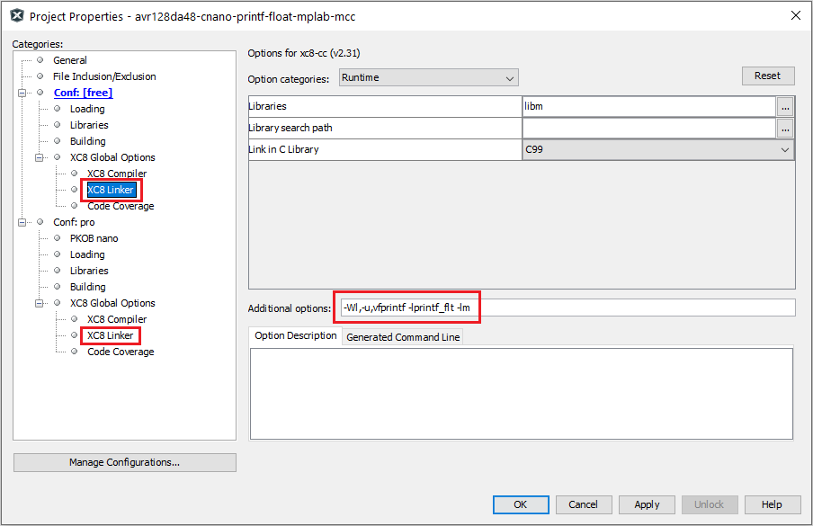
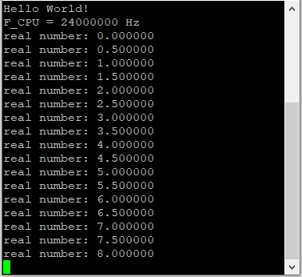

# AVR128DA48 Demo of `printf` With Floating Point Numbers Using USART and MCC

This repository provides an MPLAB® X solution for a basic `printf` demo using the USART interface to demonstrate the floating point usage. 

Problem: In XC8, with the default settings, the `printf` does not display the float and double numbers but puts a '?' in their place.

The behavior is caused by the avr-libc library which, by default, does not include support for real numbers. 
This is due to the huge size of the floating point support that is not used often.

Implementation: Put additional options to the linker which can be done in the **Properties** tab of the project:  
#### -Wl,-u,vfprintf -lprintf_flt -lm
 

This application provides an example use of floating point numbers. It prints on the serial value incremented by 0.5 and toggles the on-board LED every second.

## Related Documentation
More details and code examples on the AVR128DA48 can be found at the following links:
- [AVR128DA48 Product Page](https://www.microchip.com/wwwproducts/en/AVR128DA48)
- [AVR128DA48 Code Examples on GitHub](https://github.com/microchip-pic-avr-examples?q=avr128da48)

## Software Used
- MPLAB® X IDE 5.45 or newer [(microchip.com/mplab/mplab-x-ide)](http://www.microchip.com/mplab/mplab-x-ide)
- MPLAB® XC8 2.31 or newer [(microchip.com/mplab/compilers)](http://www.microchip.com/mplab/compilers)
- MPLAB® Code Configurator (MCC) 4.0.2 or newer [(microchip.com/mplab/mplab-code-configurator)](https://www.microchip.com/mplab/mplab-code-configurator)
- AVR-Dx_DFP 1.6.88
- 8-bit AVR MCUs Lib version 2.5.0
- Terminal software (Teraterm, Putty, Hyperterm, etc.)

## Hardware Used
- AVR128DA48 Curiosity Nano [(DM164151)](https://www.microchip.com/Developmenttools/ProductDetails/DM164151)

## Setup
The AVR128DA48 Curiosity Nano Development board is used as test platform.
 

The following configurations must be made for this project:

|Pin           | Configuration      |
| :----------: | :----------------: |
|PC6 (LED0)    | Digital Output     |
|PC0 (USART_TX)| Digital Output     |
|PC1 (USART_RX)| Digital Input      |

USART1 is configured for 115200 baud, 8N1 format.

## Operation

To program the Curiosity Nano board with this MPLAB X project, follow the steps provided in the [Program.md](./Program.md) page.

## Demo:
Using Control Panel or the system's configuration tool, identify the serial port number allocated by the OS (COMx, ttySx, etc).

Open the terminal software (Microchip Data Visualizer, putty, teraterm, minicom, etc), choose 115200 8N1 format, then connect to the appropriate serial port.

At the start a message with 'Hello World!' and on the next line is shown the CPU frequency. Then, the on-board LED starts toggling once a second, while the serial terminal displays an incrementing floating point number.

 

This image shows the received messages from the start of the program. The program will continuously increment the value with 0.5 every second.

## Summary

The demo shows a `printf` demo using floating point numbers on the AVR128DA48 Curiosity Nano Board.
