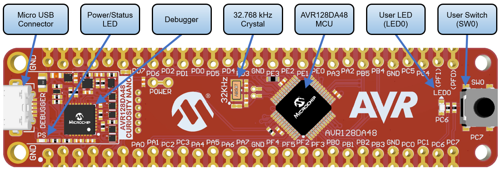

# AVR128DA48 - Demo of printf With Floating Point Numbers Using USART and MCC Melody

This repository provides an MCC Melody generated MPLAB® solution for a basic `printf` demo using the USART interface to demonstrate the floating point usage. 

This application shows an example of how to handle and print floating point numbers. It prints on the serial value incremented by 0.5 and toggles the on-board LED every second.

## Related Documentation
More details and code examples on the AVR128DA48 can be found at the following links:
- [AVR128DA48 Product Page](https://www.microchip.com/wwwproducts/en/AVR128DA48)
- [AVR128DA48 Code Examples on GitHub](https://github.com/microchip-pic-avr-examples?q=avr128da48)

## Software Used
- [MPLAB® X IDE](http://www.microchip.com/mplab/mplab-x-ide) v6.10 or newer
- [MPLAB® Code Configurator v5.3.7 or newer](https://www.microchip.com/mplab/mplab-code-configurator)
- [MPLAB® XC8](http://www.microchip.com/mplab/compilers) v2.41 or newer
- [AVR-Dx Series Device Pack](https://packs.download.microchip.com/) v2.3.272 or newer
- [MPLAB® Code Configurator Melody](https://www.microchip.com/en-us/tools-resources/configure/mplab-code-configurator/melody) v2.5.0 or newer
- AVR Devices Library v4.7.0 or newer
- Content Manager v2.3.7 or newer
- MPLAB® X Data Visualizer Plug-in

## Hardware Used
- AVR128DA48 Curiosity Nano [(DM164151)](https://www.microchip.com/Developmenttools/ProductDetails/DM164151)

## Setup
The AVR128DA48 Curiosity Nano Development board is used as a test platform.
 

The following configurations must be made for this project:

- System clock configured at 4 MHz
- USART1:
	- 115200 baud
	- 8 data bits
	- no parity bit
	- 1 stop bit

|Pin            | Configuration      |
| :----------:  | :----------------: |
|PC6 (LED0)     | Digital Output     |
|PC0 (USART1_TX)| Digital Output     |
|PC1 (USART1_RX)| Digital Input      |

## Operation

To program the Curiosity Nano board with this MPLAB® X project, follow the steps provided in the [How to Program the Curiosity Nano Board](#how-to-program-the-curiosity-nano-board) chapter.  

## Demo:
Using Control Panel or the system's configuration tool, identify the serial port number allocated by the OS (COMx, ttySx, etc).

Open Microchip Data Visualizer, choose the 115200 format, then connect to the appropriate serial port.

A message with "Hello World!" will appear on the first line and the next one shows the CPU frequency. Then, the on-board LED starts toggling once per second, while the serial terminal displays an incrementing floating point number.

 

This image shows the received messages from the start of the program. The program will continuously increment the value with 0.5 every second.

## Summary

The demo shows a `printf` demo using floating point numbers on the AVR128DA48 Curiosity Nano Board.

[Back to top](#getting-started-with-usart-using-the-avr64dd32-microcontroller-using-mcc-melody) 

## How to Program the Curiosity Nano Board

This chapter shows how to use the MPLAB® X IDE to program an AVR® device with an Example_Project.X. This can be applied to any other projects.

- Connect the board to the PC

- Open the Example_Project.X project in MPLAB® X IDE

- Set the Example_Project.X project as main project

  - Right click the project in the **Projects** tab and click **Set as Main Project**
     

- Clean and build the Example_Project.X project

  - Right click the **Example_Project.X** project and select **Clean and Build**
     

- Select **AVRxxxxx Curiosity Nano** in the Connected Hardware Tool section of the project settings:

  - Right click the project and click **Properties**
  - Click the arrow under the Connected Hardware Tool
  - Select the **AVRxxxxx Curiosity Nano** (click the **SN**), click **Apply** and then **OK**:
     

- Program the project to the board
  - Right click the project and then **Make and Program Device**
     

 

- [Back to top](#getting-started-with-usart-using-the-avr64dd32-microcontroller-using-mcc-melody) 